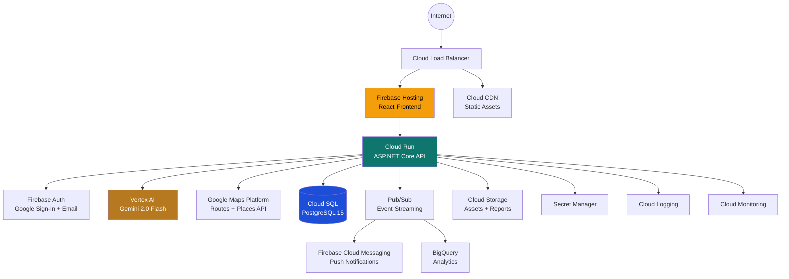
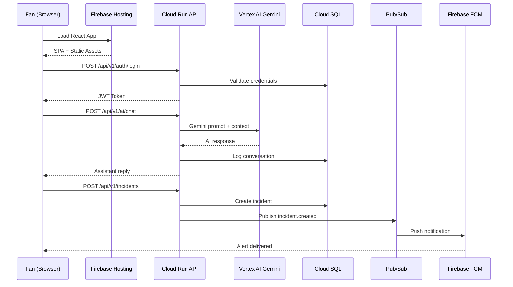

# Smart Stadium Operations — Google Cloud Architecture

## System Architecture

## Data Flow

## Service Responsibilities

| Service | Role | Scaling |
|---------|------|---------|
| **Cloud Run** | API Gateway, business logic | Auto-scale 0→100 instances |
| **Vertex AI** | AI assistant, translation, crowd intelligence | Managed, pay-per-request |
| **Cloud SQL** | Persistent data (users, matches, incidents) | Vertical + read replicas |
| **Pub/Sub** | Event streaming, async processing | Unlimited throughput |
| **Firebase Auth** | Identity, Google Sign-In, email/password | Managed, unlimited users |
| **Firebase Hosting** | Frontend CDN, global edge | Auto-scale, global CDN |
| **Cloud Storage** | Stadium maps, reports, AI artifacts | Unlimited storage |
| **Firebase FCM** | Push notifications to fans | Managed, millions/sec |
| **Google Maps** | Navigation, directions, places | Pay-per-request |
| **BigQuery** | Analytics, crowd patterns | Serverless analytics |
| **Secret Manager** | API keys, JWT secrets, DB passwords | Managed |
| **Cloud Monitoring** | Dashboards, alerting, SLOs | Managed |

## Security Architecture

- **Authentication**: Firebase Auth (Google Sign-In + Email/Password)
- **Authorization**: Role-based (RegisteredFan, Volunteer, StadiumOperator, Admin)
- **API Security**: JWT validation on every Cloud Run request
- **Secrets**: All credentials in Secret Manager (never in code)
- **Network**: HTTPS everywhere, Cloud Armor DDoS protection
- **Data**: Encryption at rest (Cloud SQL, Storage) + in transit (TLS 1.3)
