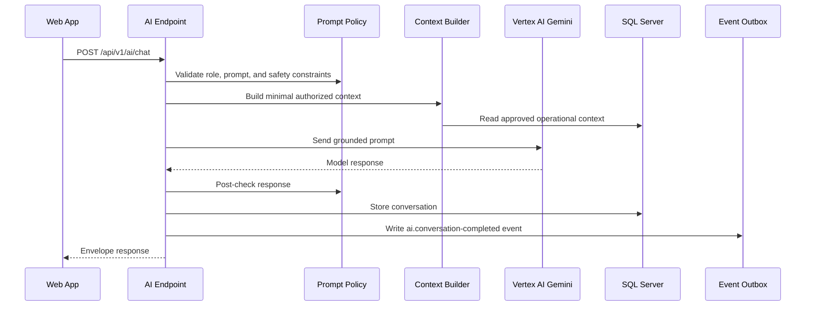

# Next Stage Generative AI Architecture

This document originally prepared the AI-focused build stage after the Stage 3 enterprise architecture checkpoint. Stage 4 now implements the first version of that foundation; the completion artifact is [Stage 4 AI Intelligence Checkpoint](stage-4-ai-intelligence-checkpoint.md).

## AI Goals

- Fan assistant for stadium services, accessibility, navigation, match-day FAQs, and notification context.
- Operations assistant for incident summaries, crowd insights, transport disruption summaries, and suggested response playbooks.
- Volunteer assistant for task clarification and escalation guidance.
- Sustainability assistant for metric summaries and anomaly explanations.

AI output must remain advisory. Emergency handling, security decisions, and venue protocol stay under human authority.

## Proposed Components

| Component | Responsibility |
| --- | --- |
| Prompt Policy | Enforce role, context limits, safety instructions, and emergency disclaimers |
| Context Builder | Pull stadium, match, POI, incident, route, and role context from application services |
| Retrieval Layer | Add approved operations manuals, venue policies, accessibility guides, and FAQ sources |
| Gemini Gateway | Call Vertex AI Gemini through server-side credentials only |
| Conversation Store | Persist prompts, responses, intent, model, token estimate, user, and correlation ID |
| Evaluation Suite | Test hallucination resistance, prompt injection, incident escalation, and unsafe advice |
| Cost Monitor | Track token usage and set per-role or per-feature budgets |

## AI Request Flow



## Guardrails

- Reject prompts that request credential disclosure, bypassing security controls, or ignoring emergency protocols.
- Strip or summarize sensitive incident details for fan roles.
- Keep role-specific context boundaries: fan, volunteer, operator, security, admin.
- Return missing-configuration errors if Vertex AI settings are absent.
- Include correlation ID in all AI logs and persisted conversations.
- Keep all prompts and retrieved context server-side.

## Retrieval Plan

Recommended document sources:

- Stadium services and accessibility guide.
- Emergency response playbooks.
- Crowd management policy.
- Transportation partner operations brief.
- Volunteer handbook.
- Sustainability reporting definitions.

Recommended storage path:

- Source files in Cloud Storage.
- Metadata and document registry in SQL Server.
- Embeddings in a managed vector store or SQL-compatible vector extension if selected later.
- Strict versioning by tournament, stadium, and effective date.

## Evaluation Plan

Automated tests should cover:

- Prompt injection attempting to reveal system instructions.
- Fan asking for restricted operations data.
- Operator asking for incident summary with missing data.
- Emergency prompt requiring handoff to venue protocol.
- Accessibility route request with known constraints.
- AI unavailable due missing Vertex AI config.
- Conversation persistence and audit event creation.

Live model tests should be gated by:

```powershell
RUN_LIVE_INTEGRATION_TESTS=true
```

## Implementation Sequence

1. Add prompt policy and tests in `StadiumOps.Application`.
2. Add AI context builder services over authorized data.
3. Add outbox event write after successful AI conversation persistence.
4. Add retrieval source registry tables.
5. Add live Vertex AI integration tests behind the environment switch.
6. Add operations AI summaries and fan FAQ flows in the web app.
