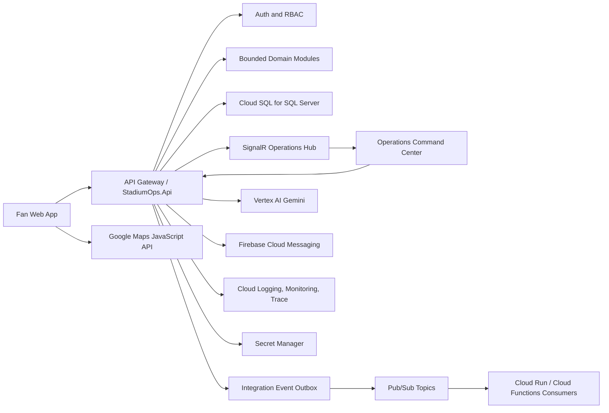
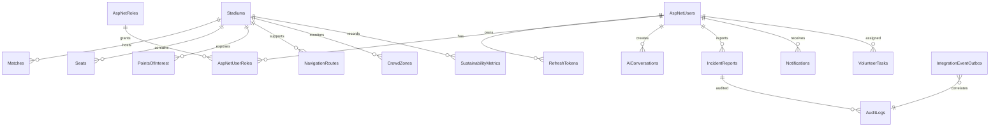
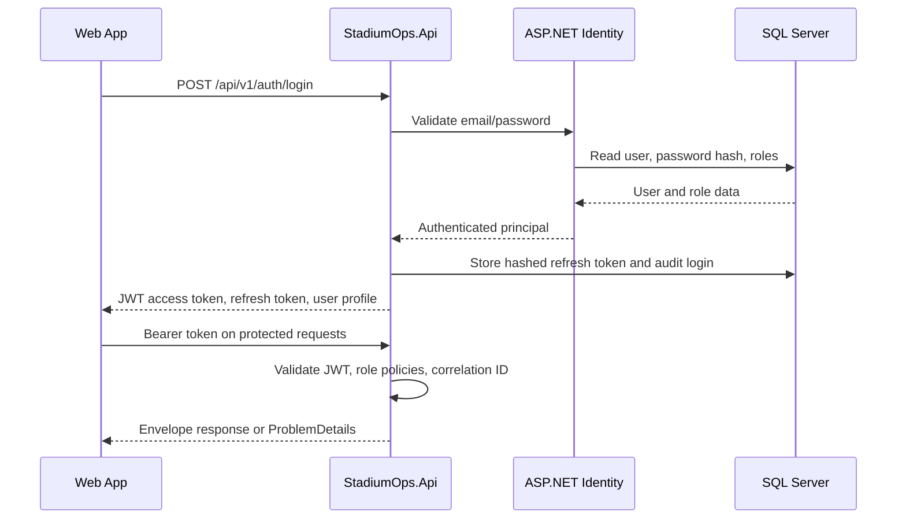

# Stage 3 Enterprise Architecture

Status: implemented as architecture documentation plus scaffold primitives.

This document maps the Smart Stadium and Tournament Operations Platform into an enterprise architecture suitable for staged extraction into microservices. The current codebase is a modular monorepo with a single ASP.NET Core API process for local velocity. Service boundaries, event contracts, data ownership, and cloud deployment targets are defined here so the platform can move from scaffold to production architecture without changing the product model.

## High-Level Design



Primary user paths:

- Fans authenticate, view today's match, inspect POIs, request routes, chat with AI, receive notifications, and report incidents.
- Operations users authenticate with privileged roles, monitor crowd zones, triage incidents, broadcast notifications, and inspect integration readiness.
- AI requests flow through the API so prompts, guardrails, audit context, and conversation history remain server controlled.
- Live operations updates move through the event outbox, Pub/Sub, and SignalR rather than being hidden in controller side effects.

## Service Boundary Design

The scaffold keeps these boundaries in one API process today. Each boundary has a clear extraction path to Cloud Run services when deployment scale or team ownership requires it.

| Boundary | Responsibilities | Primary Data | External Interfaces | Extraction Path |
| --- | --- | --- | --- | --- |
| Auth Service | Identity, JWT, refresh tokens, roles, profile, session revocation | Users, roles, refresh tokens, audit logs | `/auth/*`, JWT issuer | Separate Cloud Run service with shared Identity database or identity-owned schema |
| Fan Service | Fan dashboard, match context, POIs, accessibility preferences | Stadiums, matches, seats, POIs | `/matches/*`, `/stadiums/*` | Extract read-heavy fan APIs with cache-first query models |
| Navigation Service | Route selection, accessible routes, map handoff | Navigation routes, POIs, crowd zones | `/navigation/routes`, Maps JS in web | Extract pathfinding and crowd-aware routing service |
| Incident Service | Incident reports, prioritization, status workflow | Incident reports, audit logs | `/incidents/*`, `incident.*` events | Extract when triage volume needs dedicated scaling |
| Operations Service | Command-center overview, crowd zone monitoring | Crowd zones, incidents, transport, metrics | `/operations/*`, `/crowd/*`, SignalR hub | Extract realtime operations read model |
| Notification Service | Broadcasts, user notifications, Firebase FCM delivery | Notifications, device targets later | `/notifications/*`, Firebase Admin SDK | Extract event consumer for fan and ops messaging |
| AI Assistant Service | Gemini calls, prompt policy, conversation history | AI conversations, audit logs | `/ai/*`, Vertex AI Gemini | Extract for model policy, RAG, and cost controls |
| Transportation Service | Transit and parking status | Transport statuses | `transport.*` events, future `/transport/*` | Extract adapter-heavy transport ingestion |
| Sustainability Service | Energy, water, waste, recycling metrics | Sustainability metrics | future `/sustainability/*` | Extract batch and analytics workflows |
| Volunteer Service | Assignments, task status, team support | Volunteer tasks | future `/volunteers/*` | Extract once mobile volunteer flows expand |
| Analytics Service | Aggregated KPIs, dashboards, forecasting | Read models, event history | future `/analytics/*` | Extract around warehouse and BI workloads |

## Repository Mapping

```text
apps/
  web/                         React/Vite role-aware web application
src/
  StadiumOps.Api/              HTTP endpoints, middleware, hubs, OpenAPI, health
  StadiumOps.Application/      DTOs, policies, contracts, integration event names
  StadiumOps.Domain/           Core entities and business concepts
  StadiumOps.Infrastructure/   EF Core, Identity, SQL Server, Vertex, Firebase
tests/
  StadiumOps.UnitTests/        Domain and application-level tests
  StadiumOps.ApiTests/         API integration tests with in-memory persistence
docs/                          Architecture, cloud, design, and stage checkpoints
infra/                         Cloud Run, Docker, and local compose templates
```

## Cloud Architecture

Target GCP deployment:

- Cloud Run hosts `StadiumOps.Api` and future extracted services.
- Cloud SQL for SQL Server stores identity, operational data, audit logs, and event outbox rows.
- Secret Manager stores JWT signing key, SQL connection string, Firebase service-account material, and integration credentials.
- Vertex AI Gemini serves AI assistant requests through the server-side `Google.GenAI` adapter.
- Firebase Cloud Messaging sends fan and operations push notifications through the Firebase Admin SDK.
- Google Maps JavaScript API runs in the web app with a restricted browser key.
- Pub/Sub carries integration events from the outbox publisher to async consumers.
- Cloud Storage stores future generated reports, exports, uploaded incident attachments, and static operations evidence.
- Cloud Logging, Monitoring, Error Reporting, and Trace collect logs, metrics, alerts, and request traces.
- Cloud Armor or equivalent edge protection should sit in front of public endpoints for rate limiting and WAF policy in production.

## Database Design

The SQL Server schema is generated through EF Core migrations. The first migration covers Identity plus operational tables. Stage 3 adds `IntegrationEventOutbox` for reliable event publication.

Core tables:

- Identity: `AspNetUsers`, `AspNetRoles`, `AspNetUserRoles`, Identity claim/login/token tables.
- Auth/session: `RefreshTokens`.
- Venue and match: `Stadiums`, `Matches`, `Seats`, `PointsOfInterest`, `NavigationRoutes`.
- Operations: `CrowdZones`, `IncidentReports`, `Notifications`, `TransportStatuses`.
- Intelligence and support: `AiConversations`, `SustainabilityMetrics`, `VolunteerTasks`.
- Governance: `AuditLogs`, `IntegrationEventOutbox`.



Data design rules:

- Tables use GUID identifiers for distributed-service compatibility.
- Operational entities inherit created/updated timestamps, soft delete, and row-version concurrency.
- Refresh tokens are stored only as hashes.
- Audit logs store action, resource, optional details, IP address, and correlation ID.
- Integration events are first written transactionally to SQL Server, then published asynchronously.

## Authentication And Authorization Flow



Authorization policies:

- `OperationsAccess`: operations, admin, security, and venue-manager roles.
- `IncidentAccess`: incident responders, security, operations, and admin roles.
- `AdminOnly`: administrative service control.

## API Standards

- Base path: `/api/v1`.
- Successful JSON shape: `{ "success": true, "data": {}, "error": null, "correlationId": "..." }`.
- Error JSON uses ASP.NET `ProblemDetails` with `correlationId`.
- List endpoints return page metadata.
- All protected endpoints require bearer tokens.
- Role-protected endpoints return `401` for unauthenticated users and `403` for insufficient roles.
- Validation failures must be deterministic and must not execute side effects.
- Live integration endpoints must fail loudly with missing-configuration errors rather than returning fake success.
- Emergency and AI guidance must stay advisory and must not override venue protocol.

## Event-Driven Architecture

Stage 3 adds the outbox primitive:

- Domain/application action writes operational data and an `IntegrationEventOutbox` row in the same SQL transaction.
- Background publisher reads pending rows ordered by `CreatedAt` and `NextAttemptAt`.
- Publisher sends JSON payloads to Pub/Sub topics.
- Consumers update read models, deliver Firebase messages, push SignalR updates, or trigger analytics workflows.
- Failed publishes increment `RetryCount`, store `LastError`, and set `NextAttemptAt`.

Event names are centralized in `StadiumOps.Application.Events.IntegrationEventNames`.

Initial event catalog:

- `stadiumops.incident.reported.v1`
- `stadiumops.incident.status-changed.v1`
- `stadiumops.crowd.zone-updated.v1`
- `stadiumops.notification.broadcast-requested.v1`
- `stadiumops.ai.conversation-completed.v1`
- `stadiumops.transport.status-updated.v1`
- `stadiumops.volunteer.task-assigned.v1`

Canonical event envelope:

```json
{
  "eventType": "stadiumops.incident.reported.v1",
  "source": "StadiumOps.Api",
  "correlationId": "request-correlation-id",
  "occurredAt": "2026-07-09T15:16:21Z",
  "aggregateId": "incident-id",
  "aggregateType": "IncidentReport",
  "payloadJson": "{}"
}
```

## Realtime Updates

The API now exposes an authenticated SignalR hub:

```text
/hubs/operations
```

Initial hub groups:

- `operations`: command-center operators.
- `stadium:{stadiumId}`: stadium-specific realtime stream.

Planned push messages:

- Incident reported.
- Incident status changed.
- Crowd zone threshold crossed.
- Broadcast notification sent.
- Transport delay changed.
- AI escalation recommended.

## Caching Plan

Redis is not required for local scaffold operation, but the production architecture should add Memorystore for Redis or an equivalent managed cache for:

- Stadium and POI read models.
- Today's match list.
- Crowd zone snapshots.
- Operations overview metrics.
- Rate-limit counters if API instances scale beyond in-memory limiter suitability.
- Idempotency keys for high-risk commands.

Cache entries must include short TTLs for operational data and explicit invalidation on outbox events.

## Logging, Monitoring, And Audit

Operational telemetry should include:

- Structured logs with correlation ID, user ID when available, role, route, status code, and latency.
- Audit log rows for login, logout, refresh-token rotation, incident status changes, notification broadcasts, role changes, and AI actions.
- Metrics for request latency, auth failures, 401/403 rates, incident volume, crowd-zone alert count, AI token usage, Firebase send failures, and outbox retry depth.
- Alerts for readiness failures, SQL connectivity failure, elevated 5xx rate, outbox backlog, AI integration outage, and FCM delivery failures.

## Security Architecture

- No secrets in Git or chat.
- Use user secrets locally and Secret Manager in cloud.
- Restrict Google Maps browser key by allowed origins.
- Prefer workload identity or least-privilege service accounts for Vertex AI, Firebase, Cloud SQL, and Pub/Sub.
- Store refresh tokens only as hashes.
- Use RBAC policies on privileged endpoints.
- Preserve correlation IDs across HTTP, outbox, Pub/Sub, and SignalR.
- Log sensitive actions without storing passwords, tokens, or full credential material.
- Add attachment malware scanning before incident file uploads are enabled.
- Add security headers and edge WAF policy before public production launch.

## Scalability Plan

Near-term scaling:

- Scale Cloud Run API instances by CPU and request concurrency.
- Keep SQL Server indexes aligned with read-heavy operations views.
- Use Redis for hot read models and shared rate-limit state.
- Move live-update broadcasting into a background worker if hub traffic grows.

Service extraction triggers:

- Incident volume requires independent scaling or on-call ownership.
- AI token usage needs dedicated budget controls and model governance.
- Notification delivery requires retry isolation from user-facing requests.
- Navigation needs graph algorithms or high-frequency crowd-aware recomputation.
- Analytics requires warehouse-style storage and long-running jobs.

Data scaling:

- Archive older audit and AI conversation rows into cold storage.
- Partition or index high-volume operational tables by stadium and event date.
- Build denormalized operations read models from Pub/Sub events.
- Keep transactional writes in SQL Server and analytical aggregation outside request paths.

## Stage 3 Acceptance Criteria

- Architecture is documented with HLD, service boundaries, cloud model, API standards, auth flow, event flow, security, and scaling.
- SQL Server model includes an outbox table for event-driven workflows.
- API exposes an authenticated realtime operations hub.
- README links to Stage 2 and Stage 3 artifacts.
- Build and test commands remain available for verification.
