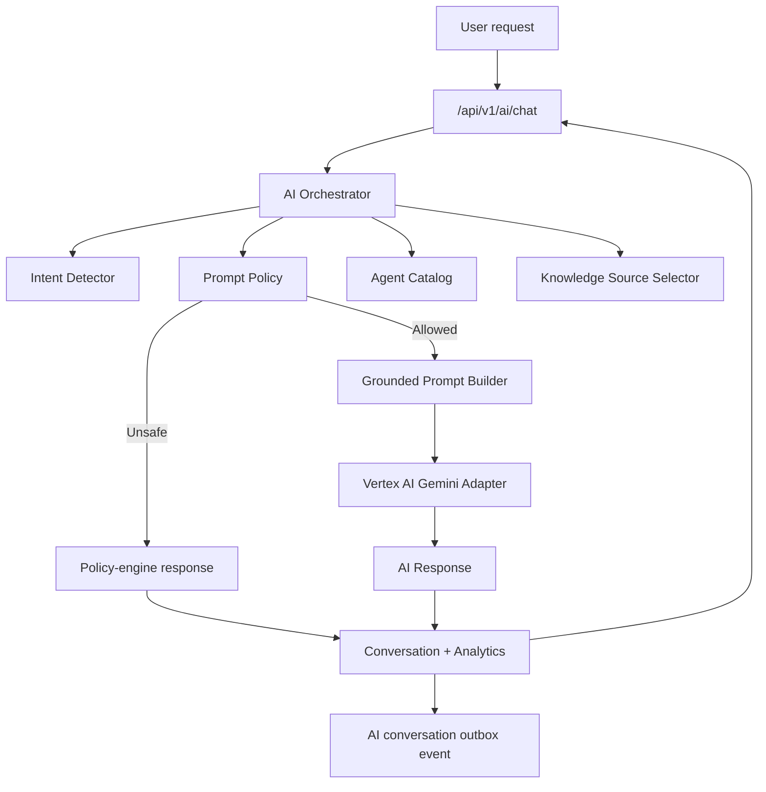
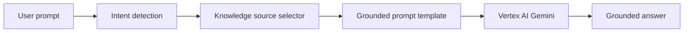

# Stage 4 AI Intelligence Checkpoint

Status: started and implemented for the enterprise AI foundation milestone.

Stage 4 moves the platform beyond a single chatbot into a multi-agent decision-support architecture. The implementation remains conservative: AI augments humans, does not replace stadium staff, emergency responders, or official venue protocols.

## Completed Scope

- Multi-agent AI catalog in application code.
- AI orchestrator service.
- Intent detection and agent routing.
- Prompt policy and safety guardrails.
- Grounded prompt template with role, context, constraints, sources, and output rules.
- Knowledge-source selector for RAG-ready workflows.
- Confidence scoring and escalation metadata.
- AI conversation persistence with agent, confidence, prompt version, sources, and guardrails.
- AI analytics event persistence.
- AI knowledge document schema and demo seed records.
- Protected API endpoint for agent catalog discovery: `GET /api/v1/ai/agents`.
- Protected API endpoint for approved AI knowledge documents: `GET /api/v1/ai/knowledge`.
- AI chat endpoint routed through the orchestrator: `POST /api/v1/ai/chat`.
- Local policy-engine response path for unsafe prompts so blocked prompts do not require Vertex AI.
- Frontend assistant metadata updated to show agent, intent, confidence, tokens, escalation state, agent catalog, and approved knowledge sources.

## AI Architecture



## Agent Catalog

Implemented agents:

- Fan Assistant Agent
- Smart Navigation Agent
- Transportation Intelligence Agent
- Accessibility Assistant
- Crowd Intelligence Agent
- Operations Intelligence Agent
- Sustainability Advisor
- Emergency Response Agent
- Volunteer Assistant
- Multilingual Translator

Each agent defines:

- stable key
- display name
- description
- supported intents
- responsibilities
- operational-role requirement
- safety-critical flag

## RAG Workflow

The current stage implements the RAG-ready structure rather than a live vector database.



Knowledge categories:

- Stadium Information
- Navigation
- Accessibility
- Transportation
- Food & Beverage
- Merchandise
- Medical Services
- Emergency Procedures
- Security Policies
- Sustainability
- Event Schedule
- Volunteer Handbook

SQL table added:

- `AiKnowledgeDocuments`

Fields include category, title, source type, source URI, summary, language, approval state, and effective dates.

## Prompt Engineering Standard

Prompts are assembled with:

- Role: selected agent identity.
- Intent: detected intent.
- User profile: language, accessibility preference, roles.
- User context: caller-supplied context.
- Retrieved knowledge sources: selected approved source categories.
- Safety constraints: hallucination, safety, accessibility, emergency, and operational-detail rules.
- Task: answer using grounded context.
- Output: clear, concise, actionable response.

Prompt version:

```text
stadiumops-ai-v1
```

## Guardrails

Implemented policy behavior:

- Declines security bypass, credential, theft, weapon, unsafe, and illegal assistance prompts.
- Adds emergency escalation guidance for emergency, medical, fire, security, lost-child, and evacuation signals.
- Adds accessibility guardrails when accessibility preferences or accessible-route intents are detected.
- Redacts operational-detail posture for non-privileged users routed to operational agents.
- Preserves the rule that AI guidance is advisory and official venue protocols take priority.

## Confidence And Escalation

The intent detector returns an internal confidence score. Responses persist:

- intent
- agent key
- agent name
- confidence score
- escalation recommended
- model
- token count
- prompt version
- grounding summary
- selected source references
- guardrail notes

Low-confidence or safety-critical routes can be escalated in later workflow stages.

## Personalization

Current personalization inputs:

- authenticated user ID
- preferred language
- accessibility preference
- caller roles
- user-supplied context

Planned inputs:

- consented current location
- ticket/seat context
- favorite team
- transportation preference
- active match attendance
- recent conversation summary

## Analytics

SQL table added:

- `AiAnalyticsEvents`

Tracked fields:

- user ID
- event name
- intent
- agent key and name
- confidence score
- escalation flag
- latency
- tokens used
- metadata JSON

This supports future dashboards for common questions, escalation rate, translation usage, accessibility requests, latency, and cost controls.

## API Surface

```text
GET  /api/v1/ai/agents
GET  /api/v1/ai/knowledge
POST /api/v1/ai/chat
GET  /api/v1/ai/conversations
```

`/ai/chat` now returns:

- conversation ID
- response
- intent
- model
- tokens used
- agent name
- confidence score
- escalation recommendation
- source categories

## Testing Framework

Added coverage:

- emergency prompt routes to Emergency Response Agent
- unsafe prompt is blocked by policy
- accessibility prompt adds accessible-route guardrail
- authenticated agent catalog endpoint returns multi-agent catalog
- authenticated knowledge endpoint returns approved demo documents
- unsafe AI chat returns policy-engine response without Vertex AI
- unsafe AI chat persists conversation and analytics

Live Vertex AI tests remain gated for a future stage behind:

```powershell
RUN_LIVE_INTEGRATION_TESTS=true
```

## Stage 4 Acceptance Status

- Multi-Agent Architecture: complete for foundation
- AI Orchestrator Design: complete for foundation
- Agent Catalog: complete
- RAG Workflow: schema and source-selection foundation complete
- Knowledge Base Structure: complete for SQL-backed registry
- Prompt Engineering Standards: complete for v1
- Conversation Management Strategy: persisted conversation metadata complete
- AI Guardrails: complete for initial policy engine
- Personalization Strategy: complete for profile/role/context inputs
- AI Analytics Plan: complete with persisted analytics event table
- AI Testing Framework: complete for unit/API foundation

## Next Stage Entry

Part 5 can build the frontend/backend implementation layer on top of this AI foundation:

- richer AI assistant UI controls
- agent-specific panels
- retrieval document administration
- live vector search adapter
- Pub/Sub outbox publisher
- operations realtime AI summaries
- full role-aware UI/UX implementation
